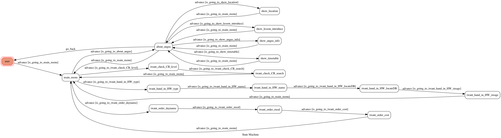

# TOC Project 2020

[](https://codeclimate.com/github/NCKU-CCS/TOC-Project-2020/maintainability)

[](https://snyk.io/test/github/NCKU-CCS/TOC-Project-2020)


Template Code for TOC Project 2020

A Line bot based on a finite state machine

More details in the [Slides](https://hackmd.io/@TTW/ToC-2019-Project#) and [FAQ](https://hackmd.io/s/B1Xw7E8kN)

## Setup

### Prerequisite
* Python 3.6
* Pipenv
* Facebook Page and App
* HTTPS Server

## 創立主旨
為協助補習班的班務順利運作，利用linebot與學生的互動，自動匯入餐費、學費處理...等處理班務需要的細節資料，以減少人工作業的時間；同時也提供補習班的資訊介紹，讓學區不在補習班附近的學生，透過linebot的互動也能認識黃杰英語。

## 介紹
### 基本資訊
linebot：黃杰英語


### 功能
主選單


+ 認識黃杰—小選單（提供黃杰的電子名片、補習班地圖位址...資訊）


+ 我要訂餐—可以訊息互動，來讀寫google sheet內建的資料，即時扣款餐費並統整當日需要叫送的餐點和數量


+ 我要找聯絡簿—根據輸入的年級，系統會自動找到當週的聯絡簿內容並回傳


+ 我要交作業—透過訊息互動，確認派發作業的項目和狀況，並自動填入學生輸入的寫作作業內容


+ 我要繳費—系統會自動導向繳費回條的連結，減少人工對帳的時間成本


#### Secret Data
You should generate a `.env` file to set Environment Variables refer to our `.env.sample`.
`LINE_CHANNEL_SECRET` and `LINE_CHANNEL_ACCESS_TOKEN` **MUST** be set to proper values.
Otherwise, you might not be able to run your code.

#### Run Locally
You can either setup https server or using `ngrok` as a proxy.

#### a. Ngrok installation
* [ macOS, Windows, Linux](https://ngrok.com/download)

or you can use Homebrew (MAC)
```sh
brew cask install ngrok
```

**`ngrok` would be used in the following instruction**

```sh
ngrok http 8000
```

After that, `ngrok` would generate a https URL.

#### Run the sever

```sh
python3 app.py
```

#### b. Servo

Or You can use [servo](http://serveo.net/) to expose local servers to the internet.


## Finite State Machine


## Usage
The initial state is set to `user`.

Every time `user` state is triggered to `advance` to another state, it will `go_back` to `user` state after the bot replies corresponding message.

## Reference
[Pipenv](https://medium.com/@chihsuan/pipenv-更簡單-更快速的-python-套件管理工具-135a47e504f4) ❤️ [@chihsuan](https://github.com/chihsuan)

[TOC-Project-2019](https://github.com/winonecheng/TOC-Project-2019) ❤️ [@winonecheng](https://github.com/winonecheng)

Flask Architecture ❤️ [@Sirius207](https://github.com/Sirius207)

[Line line-bot-sdk-python](https://github.com/line/line-bot-sdk-python/tree/master/examples/flask-echo)
